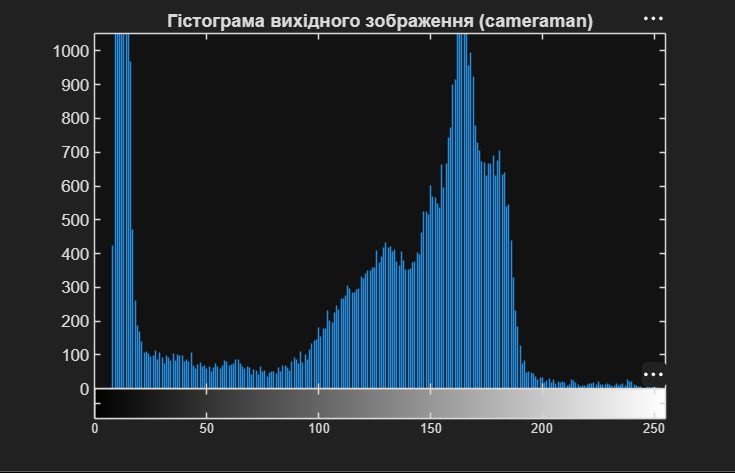
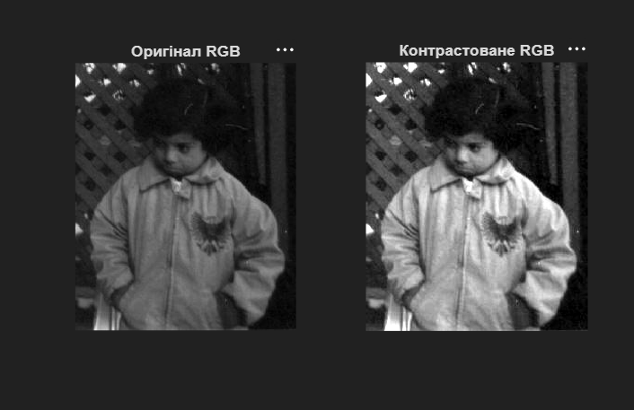
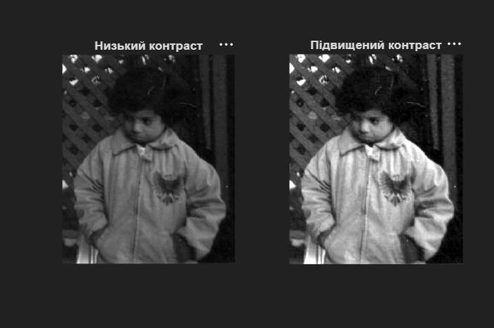
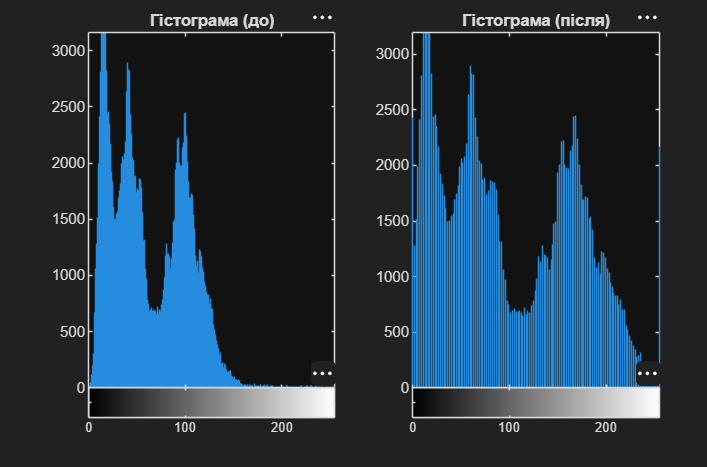

# Лабораторна робота №1
## Основи роботи з цифровими зображеннями в MATLAB

---

## Мета роботи

Ознайомлення з базовими функціями завантаження, відображення, збереження, аналізу гістограм та обробки цифрових зображень у MATLAB Image Processing Toolbox.

---

## Хід роботи

### 1. Завантаження та відображення зображень з бібліотеки MATLAB

Використано вбудовані функції MATLAB для завантаження зображень:

```matlab
img1 = imread('cameraman.png'); % Півтонове зображення
img2 = imread('peppers.jpg');   % Кольорове зображення
imshow(img1);
title('Зображення з бібліотеки: cameraman.tif');
figure, imshow(img2);
title('Зображення з бібліотеки: peppers.png');
```

---

### 2. Завантаження власного зображення

Реалізовано завантаження зображення з довільного каталогу:

```matlab
img_custom = imread('products.jpeg'); 
figure, imshow(img_custom);
title('Моє власне зображення');
```

---

### 3. Аналіз інформації про зображення

Виконано аналіз розміру, типу даних та обсягу пам'яті завантажених зображень:

```matlab
disp('Інформація про зображення:');
whos img1 img2 img_custom
```

---

### 4. Збереження зображень

Реалізовано збереження зображення у форматі JPG:

```matlab
imwrite(img1, 'saved_cameraman.jpg', 'jpg');
```

---

### 5. Гістограмний аналіз

Побудовано гістограму розподілу яскравості для аналізу динамічного діапазону зображення:

```matlab
figure, imhist(img1);
title('Гістограма вихідного зображення (cameraman)');
```

**Результат:** Гістограма показує розподіл значень яскравості у зображенні, що дозволяє оцінити контрастність та якість освітлення.



---

### 6. Контрастування кольорового зображення (RGB)

Проведено підвищення контрастності за допомогою функції `imadjust` з автоматичним визначенням оптимальних меж:

```matlab
img_low_contrast = imread('pout.jpg'); 

% stretchlim знаходить оптимальні межі для кожного каналу
img_contrasted = imadjust(img_low_contrast, stretchlim(img_low_contrast), []);

% Перевіряємо результат
figure;
subplot(1,2,1), imshow(img_low_contrast), title('Оригінал RGB');
subplot(1,2,2), imshow(img_contrasted), title('Контрастоване RGB');
```



---

### 7. Порівняння оригіналу та контрастованого зображення

Зроблено паралельне відображення оригіналу та оброблених версій:

```matlab
figure;
subplot(1,2,1), imshow(img_low_contrast), title('Низький контраст');
subplot(1,2,2), imshow(img_contrasted), title('Підвищений контраст');

% Відображення зміни гістограми після контрастування
figure;
subplot(1,2,1), imhist(img_low_contrast), title('Гістограма (до)');
subplot(1,2,2), imhist(img_contrasted), title('Гістограма (після)');
```





---

### 8. Створення негативу зображення

Реалізовано негативне перетворення шляхом інверсії діапазону значень яскравості:

```matlab
% Інвертуємо вхідні значення [0 1] у вихідні [1 0]
img_negative = imadjust(img1, [0 1], [1 0]);
figure, imshow(img_negative);
title('Негатив зображення');
```


---

## Висновок

Під час виконання лабораторної роботи було освоєно базові інструменти MATLAB Image Processing Toolbox для:
- завантаження та збереження зображень різних форматів;
- аналізу характеристик цифрових зображень;
- побудови та інтерпретації гістограм яскравості;
- виконання перетворень контрастності та отримання негативів;
- порівняння вихідних та оброблених зображень.

Набуті навички є основою для виконання складніших операцій цифрової обробки сигналів та зображень.