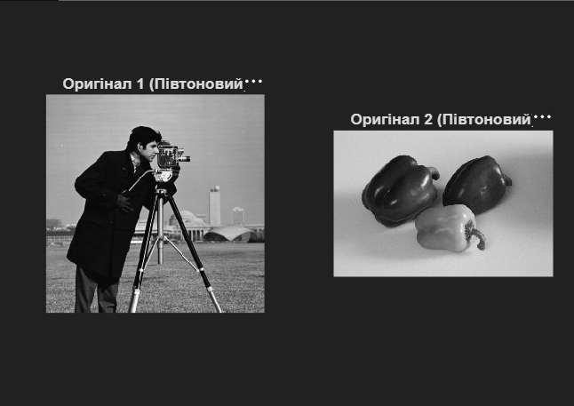
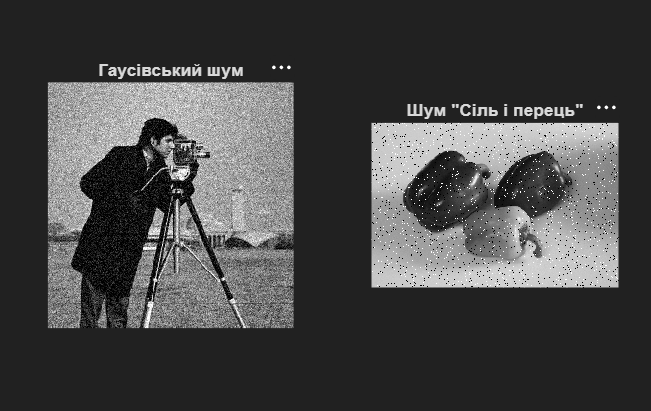
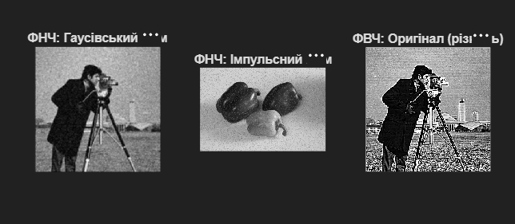
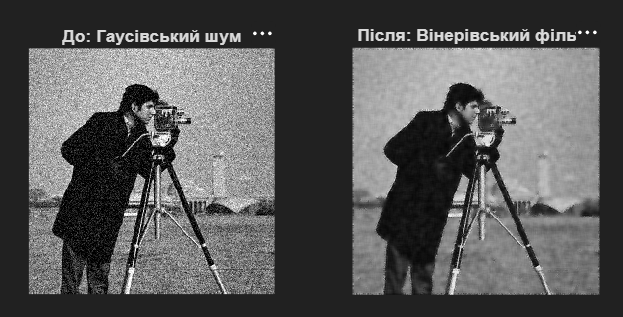
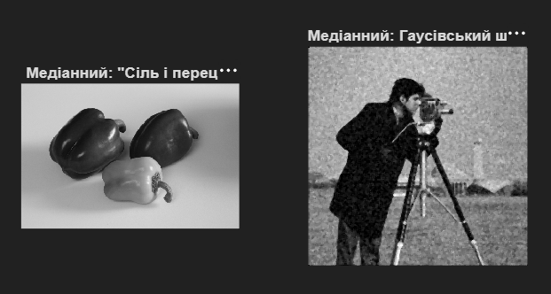

# Лабораторна робота №2
## Фільтрація та шумозаглушення цифрових зображень

---

## Мета роботи

Ознайомлення з методами фільтрації зображень, включаючи лінійні (низькочастотні та високочастотні фільтри) та нелінійні (медіанна, вінерівська) фільтри для видалення шумів та покращення якості зображень.

---

## Хід роботи

### 1. Завантаження зображень та конвертація в градації сірого

Завантажено два тестові зображення та автоматично конвертовано їх у відтінки сірого:

```matlab
img1_raw = imread('cameraman.png');
img2_raw = imread('peppers.jpg');

% Автоматична конвертація в градації сірого (якщо зображення кольорові)
if size(img1_raw, 3) == 3
    img1 = rgb2gray(img1_raw);
else
    img1 = img1_raw;
end

if size(img2_raw, 3) == 3
    img2 = rgb2gray(img2_raw);
else
    img2 = img2_raw;
end
```

---

### 2. Відображення вихідних зображень

Виведено два оригінальні зображення для подальшого порівняння:

```matlab
figure;
subplot(1,2,1), imshow(img1), title('Оригінал 1 (Півтоновий)');
subplot(1,2,2), imshow(img2), title('Оригінал 2 (Півтоновий)');
```



---

### 3. Додавання Гаусівського шуму

Застосовано білий гаусівський шум із дисперсією 0.01:

```matlab
img_noise_gauss = imnoise(img1, 'gaussian', 0, 0.01);
```

**Характеристика:** Гаусівський шум рівномірно розповсюджується по всьому зображенню та часто моделює природні джерела шуму в електронних приладах.

---

### 4. Додавання імпульсного шуму (Сіль і перець)

Застосовано імпульсний шум "сіль і перець" із щільністю 5%:

```matlab
img_noise_sp = imnoise(img2, 'salt & pepper', 0.05);
```

**Характеристика:** Імпульсний шум створює випадкові чорні та білі піксели, часто виникає при передачі даних.



---

### 5. Лінійна фільтрація: Низькочастотний фільтр (ФНЧ)

Розроблено і застосовано низькочастотний фільтр для зменшення шумів:

```matlab
h_low = ones(3,3) / 9; % Низькочастотний фільтр (усереднення)

img_lf_gauss = imfilter(img_noise_gauss, h_low); % ФНЧ для Гаусівського шуму
img_lf_sp = imfilter(img_noise_sp, h_low);       % ФНЧ для Імпульсного шуму
```

**Результат:** ФНЧ ефективно зменшує шум, але призводить до розмиття меж об'єктів.

---

### 6. Лінійна фільтрація: Високочастотний фільтр (ФВЧ)

Застосовано високочастотний фільтр для виділення контурів та підкреслення різкості:

```matlab
h_high = [-1 -1 -1; -1 9 -1; -1 -1 -1]; % Високочастотний фільтр (підкреслення різкості)

img_hf_orig = imfilter(img1, h_high); % ФВЧ для оригінального зображення
```

**Результат:** ФВЧ виділяє високочастотні компоненти (контури, переходи), але посилює шум.

---

### 7. Порівняння результатів лінійної фільтрації

Паралельне порівняння низькочастотної та високочастотної фільтрації:

```matlab
figure;
subplot(1,3,1), imshow(img_lf_gauss), title('ФНЧ: Гаусівський шум');
subplot(1,3,2), imshow(img_lf_sp), title('ФНЧ: Імпульсний шум');
subplot(1,3,3), imshow(img_hf_orig), title('ФВЧ: Оригінал (різкість)');
```



---

### 8. Адаптивна вінерівська фільтрація

Застосовано вінерівський фільтр для оптимальної фільтрації з врахуванням статистики сигналу:

```matlab
img_wien_gauss = wiener2(img_noise_gauss, [5 5]);

figure;
subplot(1,2,1), imshow(img_noise_gauss), title('До: Гаусівський шум');
subplot(1,2,2), imshow(img_wien_gauss), title('Після: Вінерівський фільтр');
```

**Переваги:** Вінерівський фільтр забезпечує кращий баланс між видаленням шуму та збереженням деталей в порівнянні з простим усередненням.



---

### 9. Медіанна фільтрація (Нелінійна)

Застосовано медіанний фільтр до обох типів шумів:

```matlab
img_med_sp = medfilt2(img_noise_sp);
img_med_gauss = medfilt2(img_noise_gauss);

figure;
subplot(1,2,1), imshow(img_med_sp), title('Медіанний: "Сіль і перець"');
subplot(1,2,2), imshow(img_med_gauss), title('Медіанний: Гаусівський шум');
```

**Характеристика:** Медіанний фільтр особливо ефективний для видалення імпульсного шуму, зберігаючи гостроту меж.



---

## Порівняльний аналіз методів фільтрації

| Метод | Гаусівський шум | Імпульсний шум | Збереження меж |
|-------|-----------------|-----------------|----------------|
| **ФНЧ (Усереднення)** | Хороше | Задовільно | Низьке |
| **Вінерівський фільтр** | Дуже хороше | Хороше | Хороше |
| **Медіанний фільтр** | Задовільно | Дуже хороше | Дуже хороше |
| **ФВЧ** | Посилює шум | Посилює шум | Дуже гарне |

---

## Висновок

Під час виконання лабораторної роботи було освоєно:
- методи додавання різних типів шумів до зображень;
- лінійну фільтрацію (низько- та високочастотні фільтри);
- адаптивні методи фільтрації (вінерівський фільтр);
- нелінійну фільтрацію (медіанний фільтр);
- порівняння та аналіз ефективності різних методів фільтрації.

Вибір методу фільтрації залежить від типу шуму та вимог до якості результату. Вінерівський та медіанний фільтри забезпечують найкращий баланс між видаленням шуму та збереженням деталей зображення.