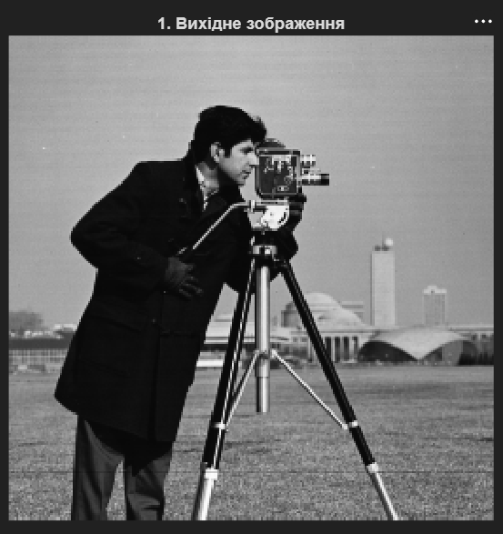
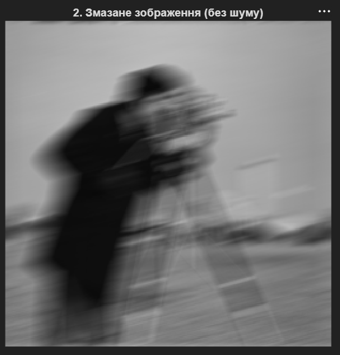
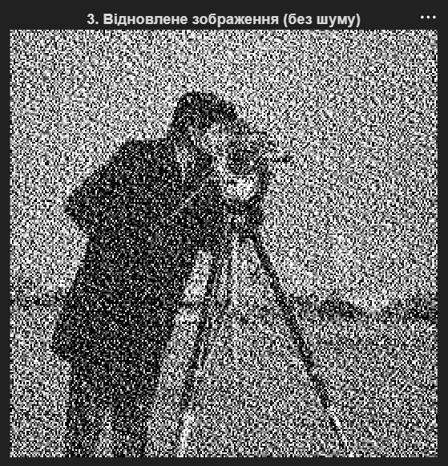
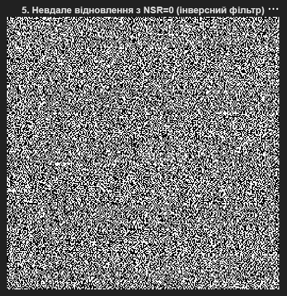
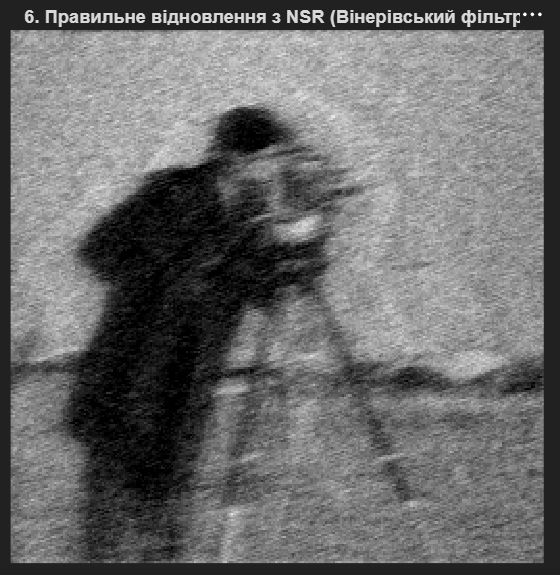

# Лабораторна робота №3
## Відновлення зображень: Деконволюція та фільтрація Вінера

---

## Мета роботи

Ознайомлення з методами відновлення зображень, пошкоджених змаканням (motion blur) та шумом, з використанням деконволюції та адаптивного фільтра Вінера для оцінки якості та ефективності різних підходів.

---

## Хід роботи

### 1. Завантаження та підготовка зображення

Завантажено тестове зображення та автоматично конвертовано його у градації сірого:

```matlab
img_raw = imread('cameraman.png');

% Автоматичне перетворення в градації сірого (захист від помилок RGB)
if size(img_raw, 3) == 3
    img = rgb2gray(img_raw);
else
    img = img_raw;
end
```

---

### 2. Відображення вихідного зображення

Виведено оригінальне чисте зображення для подальшого порівняння:

```matlab
figure;
imshow(img);
title('1. Вихідне зображення');
```



---

### 3. Моделювання змазання (Motion Blur)

Симульовано змазання внаслідок руху камери, що є однією з найпоширеніших форм перекручення зображень:

```matlab
LEN = 30;     % Величина зсуву в пікселях (можна змінювати)
THETA = 15;   % Кут руху в градусах (можна змінювати)
PSF = fspecial('motion', LEN, THETA); % Створення функції розсіювання точки (PSF)
blurred = imfilter(img, PSF, 'conv', 'circular'); % Моделювання змазання
```

**Параметри:**
- **LEN = 30:** Довжина руху в пікселях
- **THETA = 15:** Кут руху відносно горизонталі
- **PSF (Point Spread Function):** Ядро згортки, що описує механізм змазання

---

### 4. Відображення змаканого зображення

Виведено результат змазання без додаткового шуму:

```matlab
figure;
imshow(blurred);
title('2. Змазане зображення (без шуму)');
```



---

### 5. Відновлення чистого змаканого зображення

Застосовано інверсний фільтр (фільтр Вінера з NSR = 0) для ідеальної деконволюції без урахування шуму:

```matlab
% Третій параметр (NSR) дорівнює 0, що реалізує ідеальний інверсний фільтр
restored_clean = deconvwnr(blurred, PSF, 0);

figure;
imshow(restored_clean);
title('3. Відновлене зображення (без шуму)');
```

**Результат:** При відсутності шуму інверсний фільтр ефективно відновлює оригінальне зображення.



---

### 6. Моделювання змазання зі шумом

Додано гаусівський шум до змаканого зображення:

```matlab
noise_var = 0.002; % Дисперсія гаусівського шуму
blurred_noisy = imnoise(blurred, 'gaussian', 0, noise_var);

figure;
imshow(blurred_noisy);
title('4. Змазане + зашумлене зображення');
```


---

### 7. Невдала спроба відновлення з інверсним фільтром

Продемонстровано неефективність інверсного фільтра при наявності шуму:

```matlab
% Спроба відновлення зашумленого зображення БЕЗ врахування шуму (NSR = 0)
% Побачимо ефект посилення шуму зворотним фільтром
restored_noisy_naive = deconvwnr(blurred_noisy, PSF, 0);

figure;
imshow(restored_noisy_naive);
title('5. Невдале відновлення з NSR=0 (інверсний фільтр)');
```

**Проблема:** Інверсний фільтр посилює шум, що призводить до розпливчастого та зашумленого результату, часто гіршого за оригінальне змазане зображення.



---

### 8. Правильне відновлення фільтром Вінера

Застосовано адаптивний фільтр Вінера з врахуванням відношення шум-сигнал (NSR):

```matlab
% Правильне відновлення зашумленого зображення за допомогою фільтра Вінера
% Обчислюємо приблизне відношення шум/сигнал (NSR)
img_double = im2double(img);
nsr = noise_var / var(img_double(:)); 
restored_noisy_wiener = deconvwnr(blurred_noisy, PSF, nsr);

figure;
imshow(restored_noisy_wiener);
title('6. Правильне відновлення з NSR (Вінерівський фільтр)');
```

**Переваги фільтра Вінера:**
- Враховує статистику шуму та сигналу
- Оптимізує баланс між видаленням шуму та збереженням деталей
- Забезпечує кращі результати порівняно з інверсним фільтром



---

## Порівняльний аналіз методів

| Метод | Без шуму | З шумом | Посилення шуму | Якість результату |
|-------|----------|---------|-----------------|-------------------|
| **Інверсний фільтр (NSR=0)** | Дуже хороше | Погано | Дуже велике | Низька з шумом |
| **Фільтр Вінера (NSR>0)** | Хороше | Дуже хороше | Мінімальне | Висока |

---

## Ключові концепції

### Функція розсіювання точки (PSF)
PSF визначає, як кожна точка оригіналу впливає на результуюче зображення. Для руху це лінія певної довжини під кутом.

### Інверсна фільтрація
Простий метод, що працює добре лише при повній відсутності шуму. При наявності шуму призводить до посилення високочастотних компонентів.

### Фільтр Вінера
Оптимальний в сенсі мінімізації середньої квадратичної похибки фільтр, який враховує статистику сигналу та шуму через параметр NSR (Noise-to-Signal Ratio).

---

## Висновок

Під час виконання лабораторної роботи було освоєно:
- моделювання змазання зображень внаслідок руху камери;
- різниці між інверсним фільтром та фільтром Вінера;
- ефект посилення шуму при використанні простих методів деконволюції;
- застосування адаптивного фільтра Вінера для оптимального відновлення зображень;
- оцінку якості відновлення в залежності від присутності шуму.

Фільтр Вінера є практичним рішенням для відновлення зображень в реальних умовах, де завжди присутній шум. Правильне визначення параметра NSR критично важливе для досягнення оптимальних результатів.