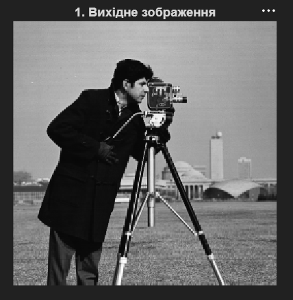
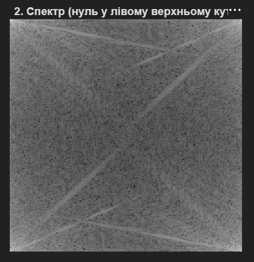
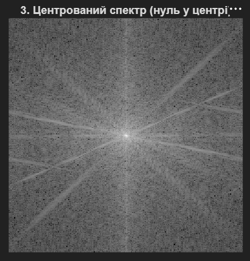
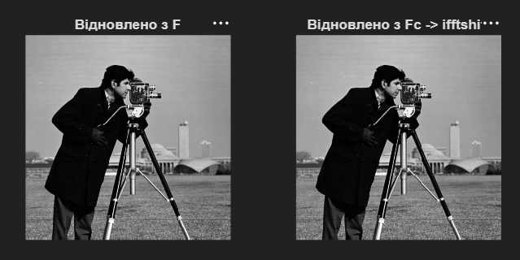
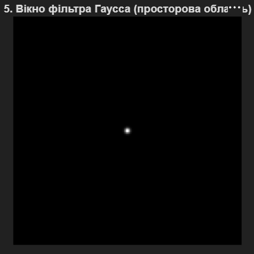
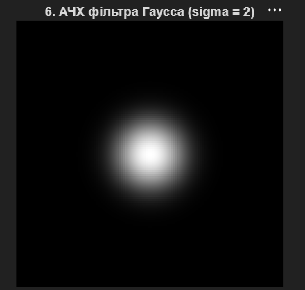
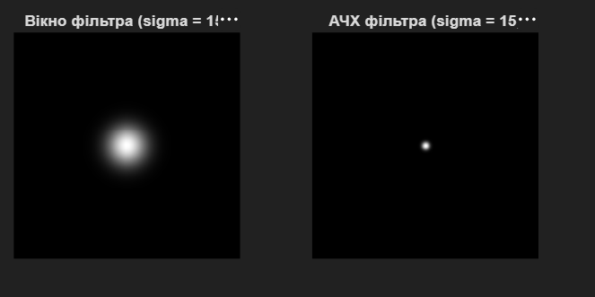
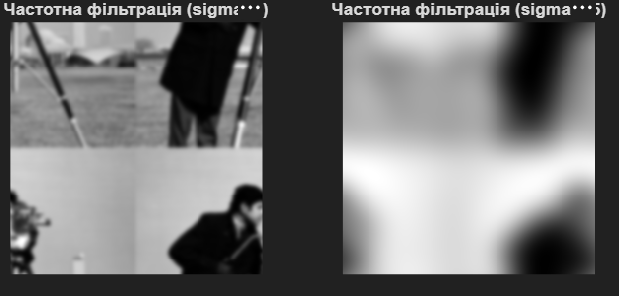
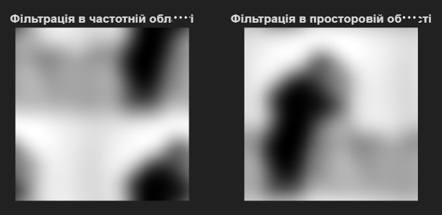

# Лабораторна робота №4
## Аналіз та обробка зображень у частотній області. Швидке перетворення Фур'є

---

## Мета роботи

Ознайомлення з методами аналізу та обробки зображень у частотній області за допомогою дискретного перетворення Фур'є (ДПФ), розуміння властивостей частотних спектрів, проектування та застосування частотних фільтрів для обробки зображень.

---

## Хід роботи

### 1. Завантаження та підготовка зображення

Завантажено тестове зображення та автоматично конвертовано його у градації сірого:

```matlab
img_raw = imread('cameraman.png');

% Перетворення в градації сірого, якщо зображення кольорові (RGB)
if size(img_raw, 3) == 3
    img = rgb2gray(img_raw);
else
    img = img_raw;
end

[M, N] = size(img); % Отримуємо реальні розміри зображення

figure;
imshow(img);
title('1. Вихідне зображення');
```



---

### 2. Обчислення ДПФ та відображення спектра

Обчислено двовимірне дискретне перетворення Фур'є та побудовано амплітудний спектр:

```matlab
F = fft2(double(img)); % Пряме ДПФ
S = abs(F);            % Модуль спектра (амплітудний спектр)
Slog = log(1 + S);     % Логарифмічний масштаб для візуалізації

figure;
imshow(Slog, []);
title('2. Спектр (нуль у лівому верхньому куті)');
```

**Характеристика:** Нульова частота (константна компонента) розташована в лівому верхньому куті матриці спектра.



---

### 3. Центрування спектра (fftshift)

Здійснено перестановку спектра так, щоб нульова частота розташувалась у центрі:

```matlab
Fc = fftshift(F);      % Зсув нульової частоти в центр
Sclog = log(1 + abs(Fc));

figure;
imshow(Sclog, []);
title('3. Центрований спектр (нуль у центрі)');
```

**Переваги центрування:**
- Улегшує візуалізацію та інтерпретацію спектра
- Низькочастотні компоненти розташуються в центрі
- Високочастотні компоненти розташуються по периметру



---

### 4. Відновлення зображення за його спектром (ifft2)

Продемонстровано відновлення вихідного зображення із його спектра за допомогою оберненого ДПФ:

```matlab
% Варіант А: Відновлення з нецентрованого спектра
img_res1 = ifft2(F);

% Варіант Б: Відновлення з центрованого спектра (потрібен зворотний зсув!)
F_unshifted = ifftshift(Fc);
img_res2 = ifft2(F_unshifted);

figure;
subplot(1,2,1), imshow(abs(img_res1), []), title('Відновлено з F');
subplot(1,2,2), imshow(abs(img_res2), []), title('Відновлено з Fc -> ifftshift');
```

**Результат:** Обидва варіанти дають ідентичне оригінальне зображення, що підтверджує оборотність ДПФ.



---

### 5. Створення фільтра Гаусса (sigma = 2)

Розроблено низькочастотний фільтр Гаусса з малою стандартною дисперсією (sigma = 2):

```matlab
sigma1 = 2;
% Створюємо фільтр, розмір якого ТОЧНО збігається з розміром зображення [M N]
h1 = fspecial('gaussian', [M N], sigma1); 

figure;
imshow(h1, []); % Відображення вікна фільтра в просторовій області
title('5. Вікно фільтра Гаусса (просторова область)');
```

**Характеристика:** Вузьке вікно Гаусса в просторовій області відповідає широкій частотній характеристиці.



---

### 6. Частотна характеристика фільтра (sigma = 2)

Обчислено та відображено амплітудно-частотну характеристику (АЧХ) фільтра:

```matlab
H1 = fft2(h1); % Частотна характеристика фільтра (ЧХ)
H1_shift = fftshift(abs(H1));

figure;
imshow(log(1 + H1_shift), []);
title('6. АЧХ фільтра Гаусса (sigma = 2)');
```

**Спостереження:** Широка АЧХ означає, що фільтр пропускає як низькочастотні, так і деякі високочастотні компоненти.



---

### 7. Варіація параметра sigma (sigma = 15)

Продемонстровано вплив збільшення sigma на форму фільтра та його частотну характеристику:

```matlab
sigma2 = 15;
h2 = fspecial('gaussian', [M N], sigma2);
H2 = fft2(h2);
H2_shift = fftshift(abs(H2));

figure;
subplot(1,2,1), imshow(h2, []), title('Вікно фільтра (sigma = 15)');
subplot(1,2,2), imshow(log(1 + H2_shift), []), title('АЧХ фільтра (sigma = 15)');
```

**Порівняння:**
- **Sigma = 2:** Вузьке вікно → широка АЧХ (пропускає більше частот)
- **Sigma = 15:** Широке вікно → вузька АЧХ (низькочастотний фільтр)



---

### 8. Фільтрація у частотній області

Застосовано фільтрацію множенням спектра зображення на частотну характеристику фільтра:

```matlab
% Поелементне множення спектра зображення на ЧХ фільтра
IF1 = F .* H1; % для sigma = 2 (вузьке вікно в просторі = широка АЧХ)
IF2 = F .* H2; % для sigma = 15 (широке вікно в просторі = вузька АЧХ)

% Зворотне перетворення для отримання відфільтрованих зображень
img_filtered_freq1 = abs(ifft2(IF1));
img_filtered_freq2 = abs(ifft2(IF2));

figure;
subplot(1,2,1), imshow(img_filtered_freq1, []), title('Частотна фільтрація (sigma=2)');
subplot(1,2,2), imshow(img_filtered_freq2, []), title('Частотна фільтрація (sigma=15)');
```

**Результат:**
- **Sigma = 2:** Незначна фільтрація, збережені більшість деталей
- **Sigma = 15:** Інтенсивна фільтрація, розмиття зображення



---

### 9. Порівняння частотної та просторової фільтрації

Продемонстровано еквівалентність фільтрації у частотній та просторовій областях:

```matlab
% Фільтрація в просторовій області через imfilter
img_filtered_spatial = imfilter(double(img), h2, 'conv', 'circular');

figure;
subplot(1,2,1), imshow(img_filtered_freq2, []), title('Фільтрація в частотній області');
subplot(1,2,2), imshow(img_filtered_spatial, []), title('Фільтрація в просторовій області');
```

**Висновок:** Обидва методи дають практично ідентичні результати, що демонструє математичну еквівалентність операцій згортки в просторовій та частотній областях.



---

## Ключові концепції

### Дискретне перетворення Фур'є (ДПФ)
ДПФ розкладає зображення на суму синусоїдальних компонент різних частот. Це дозволяє переходити з просторової області в частотну.

### Теорема про згортку
Множення у частотній області відповідає згортці у просторовій області:
$$f(x,y) * h(x,y) \Leftrightarrow F(u,v) \cdot H(u,v)$$

### Низькочастотні фільтри
Пропускають низькі частоти (гладкі зміни яскравості), придушують високі частоти (різкі переходи). Результат - розмиття зображення.

### Високочастотні фільтри
Пропускають високі частоти (деталі, контури), придушують низькі частоти. Результат - виділення контурів.

---

## Висновок

Під час виконання лабораторної роботи було освоєно:
- обчислення та візуалізацію двовимірного спектра Фур'є;
- операції з центруванням спектра (fftshift/ifftshift);
- розуміння зв'язку між просторовою та частотною формою сигналу;
- проектування та застосування частотних фільтрів;
- розуміння впливу параметрів фільтра на його частотну характеристику;
- демонстрацію еквівалентності фільтрації в просторовій та частотній областях.

Аналіз у частотній області дозволяє глибше розуміти природу обробки зображень та є основою для багатьох сучасних методів обробки сигналів та зображень.