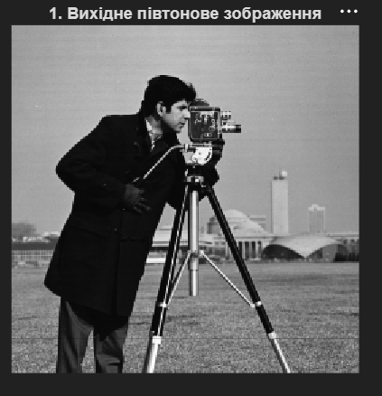
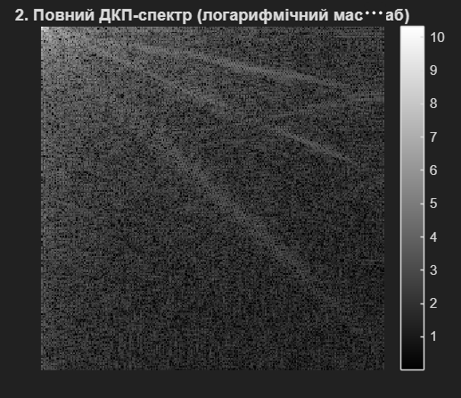
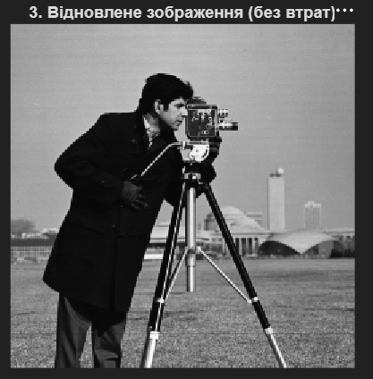
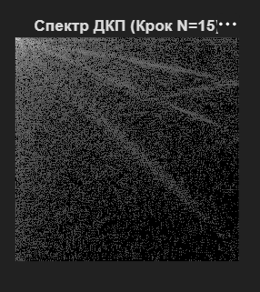
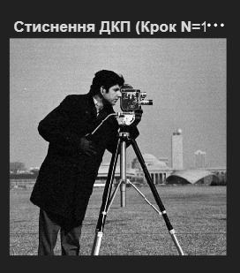
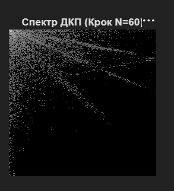
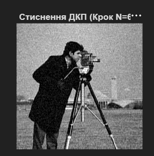
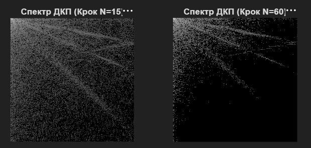
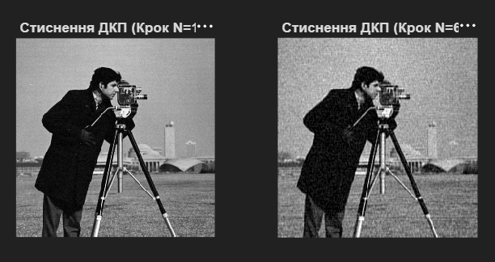
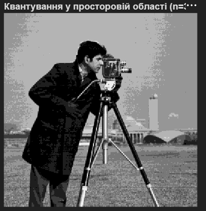

# Лабораторна робота №5
## Стиснення зображень. Дискретне косинусне перетворення та квантування

---

## Мета роботи

Ознайомлення з методами стиснення цифрових зображень, розуміння принципів дискретного косинусного перетворення (ДКП) та квантування коефіцієнтів, дослідження впливу рівня квантування на якість та коефіцієнт стиснення зображення.

---

## Хід роботи

### 1. Завантаження та підготовка зображення

Завантажено тестове півтонове зображення та автоматично конвертовано його у градації сірого:

```matlab
img_raw = imread('cameraman.png');

if size(img_raw, 3) == 3
    img = rgb2gray(img_raw);
else
    img = img_raw;
end

figure; imshow(img); 
title('1. Вихідне halvtone зображення');
```



---

### 2. Двовимірне дискретне косинусне перетворення (ДКП)

Обчислено ДКП оригінального зображення та відображено повний спектр у логарифмічному масштабі:

```matlab
J = dct2(double(img));

figure; imshow(log(1 + abs(J)), []); colorbar;
title('2. Повний ДКП-спектр (логарифмічний масштаб)');
```

**Характеристика ДКП:**
- Перетворює зображення з просторової області в область косинусних коефіцієнтів
- Низькочастотні компоненти (великі значення) розташуються в лівому верхньому куті
- Високочастотні компоненти (малі значення) розташуються по периметру
- Більшість енергії зосереджена в кількох коефіцієнтах (властивість компактності)



---

### 3. Ідеальне відновлення зображення без втрат

Продемонстровано оборотність ДКП - відновлення оригіналу без будь-яких втрат:

```matlab
img_perfect = idct2(J);
figure; imshow(uint8(img_perfect)); 
title('3. Відновлене зображення (без втрат)');
```

**Результат:** Відновлене зображення ідентичне оригіналу, що підтверджує математичну оборотність перетворення.



---

### 4-5. Квантування ДКП-коефіцієнтів (помірне стиснення, N=15)

Проведено квантування ДКП-коефіцієнтів з кроком N=15 для реалізації помірного стиснення:

```matlab
N1 = 15; 
J_quant1 = round(J / N1) * N1; 
img_restored1 = idct2(J_quant1);
```

**Процес квантування:**
1. Поділення коефіцієнтів на крок квантування N
2. Округлення до найближчого цілого числа
3. Множення назад на N

**Результат:** При N=15 досягається значне стиснення з прийнятною якістю.





---

### 6. Квантування ДКП-коефіцієнтів (сильне стиснення, N=60)

Проведено квантування з більшим кроком N=60 для демонстрації агресивного стиснення:

```matlab
N2 = 60; 
J_quant2 = round(J / N2) * N2; 
img_restored2 = idct2(J_quant2);
```

**Характеристика:**
- Більший крок квантування → більше нулювання коефіцієнтів
- Більший коефіцієнт стиснення, але гірша якість зображення
- Виникають артефакти, особливо блокові структури розміром 8×8 пікселів (розмір блоків ДКП)





---

### 7. Порівняння квантованих спектрів

Паралельне відображення спектрів при різних рівнях квантування:

```matlab
figure;
subplot(1,2,1), imshow(log(1 + abs(J_quant1)), []), title(['Спектр ДКП (Крок N=' num2str(N1) ')']);
subplot(1,2,2), imshow(log(1 + abs(J_quant2)), []), title(['Спектр ДКП (Крок N=' num2str(N2) ')']);
```

**Спостереження:**
- При N=15: спектр містить більше ненульових коефіцієнтів
- При N=60: спектр значно рідший (більше нулів)



---

### 8. Порівняння відновлених зображень після стиснення

Відображено результати відновлення при різних рівнях квантування:

```matlab
figure;
subplot(1,2,1), imshow(img_restored1, [0 255]), title(['Стиснення ДКП (Крок N=' num2str(N1) ')']);
subplot(1,2,2), imshow(img_restored2, [0 255]), title(['Стиснення ДКП (Крок N=' num2str(N2) ')']);
```

**Аналіз якості:**
- **N=15:** Мінімальні артефакти, зображення майже ідентичне оригіналу
- **N=60:** Видимі артефакти, особливо блокові структури та втрата деталей



---

### 9. Квантування у просторовій області

Продемонстровано альтернативний метод квантування безпосередньо у просторовій області для порівняння:

```matlab
n_spatial = 30; % Крок квантування яскравості
img_spatial_quant = round(double(img) / n_spatial) * n_spatial;

figure;
imshow(img_spatial_quant, [0 255]);
title(['Квантування у просторовій області (n=' num2str(n_spatial) ')']);
```

**Характеристика:**
- Квантування у просторовій області призводить до непривабливих артефактів "плоских областей"
- Виглядає як суцільні блоки одного кольору
- Менш ефективне для компресії через відсутність врахування перцептивних властивостей зору



---

## Порівняльний аналіз методів

| Параметр | N=15 (Помірне) | N=60 (Сильне) | Просторове |
|----------|-----------------|----------------|-----------|
| **Коефіцієнт стиснення** | Середній | Високий | Низький |
| **Якість зображення** | Дуже хороша | Задовільна | Погана |
| **Видимі артефакти** | Мінімальні | Видимі блоки | Помітні блоки |
| **Придатність для JPG** | Гарна | Приймається | Не використовується |

---

## Ключові концепції

### Дискретне косинусне перетворення (ДКП)
- Розкладає зображення на суму косинусних базисних функцій різних частот
- Має властивість енергетичної компактності - більшість енергії в кількох коефіцієнтах
- Математично близьке до оптимального перетворення Карунена-Лоева

### Квантування
- Процес округлення коефіцієнтів до дискретних рівнів
- Основний механізм втратного стиснення
- Де факто необоротний процес - втрачена інформація не може бути повністю відновлена

### Блокове структурування артефактів
- ДКП зазвичай застосовується до блоків 8×8 пікселів
- При агресивному квантуванні виникають помітні межі між блоками
- Цей артефакт називається "блокіністю" (blockiness)

---

## Висновок

Під час виконання лабораторної роботи було освоєно:
- обчислення та інтерпретацію ДКП спектра зображення;
- процес квантування коефіцієнтів для стиснення;
- вплив параметра квантування на якість та коефіцієнт стиснення;
- порівняння втратного стиснення в трансформованій та просторовій областях;
- розуміння математичних основ JPEG-подібних алгоритмів стиснення.

ДКП з наступним квантуванням є основою популярного формату JPEG. Правильний вибір рівня квантування критично важливий для досягнення оптимального балансу між якістю зображення та степенем стиснення.