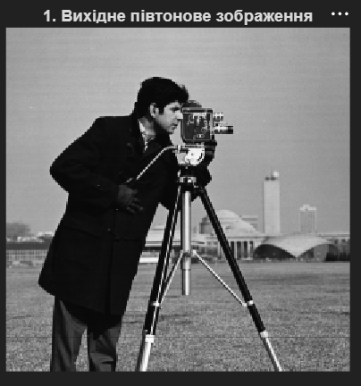
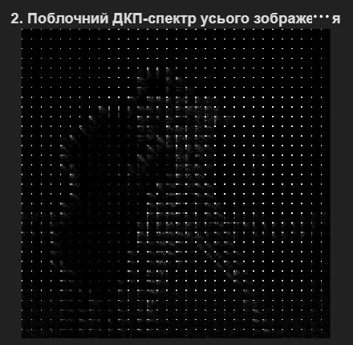
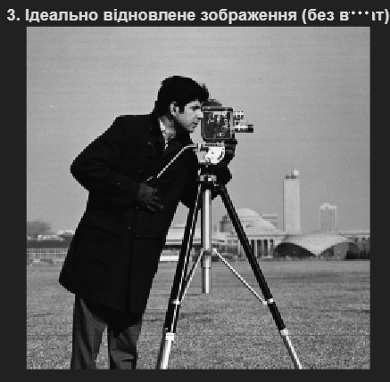
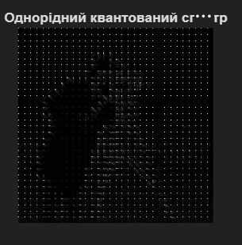
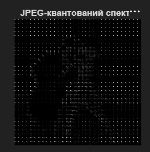
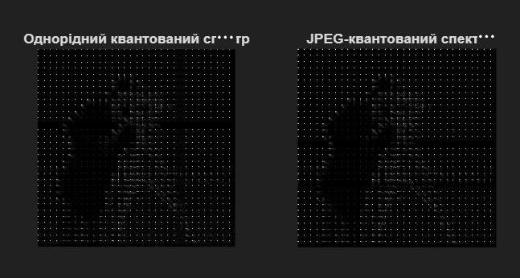
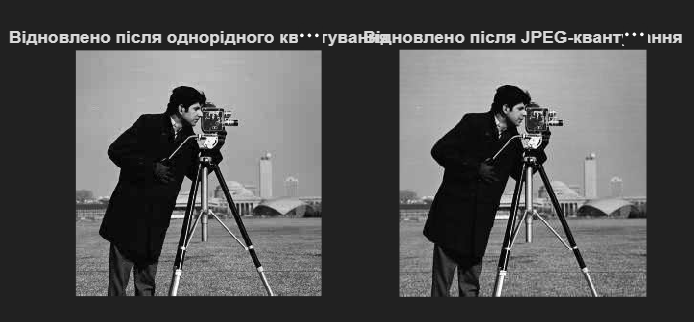

# Лабораторна робота №6
## Поблочне ДКП та JPEG-подібне стиснення

---

## Мета роботи

Ознайомлення з методами поблочного дискретного косинусного перетворення (ДКП), розуміння принципів JPEG-подібного стиснення з матричним квантуванням, порівняння однорідного та адаптивного квантування для оцінки ефективності та якості алгоритмів стиснення.

---

## Хід роботи

### 1. Завантаження та підготовка зображення

Завантажено тестове півтонове зображення та конвертовано його у градації сірого:

```matlab
img_raw = imread('cameraman.png');

if size(img_raw, 3) == 3
    img = rgb2gray(img_raw);
else
    img = img_raw;
end

% Переведення у формат double (значення від 0 до 1) для ДКП обчислень
I = im2double(img);

figure; imshow(I);
title('1. Вихідне півтонове зображення');
```



---

### 2. Поблочне ДКП (розмір блоку 8×8)

Обчислено ДКП окремих блоків розміром 8×8 пікселів, як це робиться у JPEG-алгоритмі:

```matlab
T = dctmtx(8); % Базова матриця ДКП 8х8
dct_func = @(block_struct) T * block_struct.data * T';
B = blockproc(I, [8 8], dct_func);

figure; imshow(log(1 + abs(B)), []);
title('2. Поблочний ДКП-спектр усього зображення');
```

**Характеристика:**
- Матриця `T` розміру 8×8 містить базисні функції ДКП
- Трансформація блоку здійснюється як: `B = T * I_block * T'`
- Функція `blockproc` автоматично обробляє всі 8×8 блоки зображення
- Результат показує розподіл ДКП-коефіцієнтів в логарифмічному масштабі



---

### 3. Відновлення зображення без втрат

Продемонстровано оборотність поблочного ДКП - відновлення оригіналу без втрат:

```matlab
invdct_func = @(block_struct) T' * block_struct.data * T;
I_perfect = blockproc(B, [8 8], invdct_func);

figure; imshow(I_perfect);
title('3. Ідеально відновлене зображення (без втрат)');
```

**Результат:** Зображення ідентичне оригіналу, що підтверджує коректність поблочної трансформації.



---

### 4. Однорідне квантування

Застосовано однорідне квантування з рівномірним кроком квантування:

```matlab
q = 0.1; 
B_uniform_quant = q * round(B / q);
I_uniform = blockproc(B_uniform_quant, [8 8], invdct_func);
```

**Характеристика однорідного квантування:**
- Використовує один кроком квантування для всіх коефіцієнтів
- Простий метод, але не оптимальний для людського ока
- Не враховує чутливість зору до різних частот
- Рівномірно розподіляє помилки квантування по всім коефіцієнтам



---

### 5. JPEG-подібне матричне квантування

Застосовано матричне (JPEG) квантування з використанням стандартної матриці квантування:

```matlab
% Стандартна матриця яскравості JPEG
Q_matrix = [16 11 10 16 24  40  51  61;
    12 12 14 19 26  58  60  55;
    14 13 16 24 40  57  69  56;
    14 17 22 29 51  87  80  62;
    18 22 37 56 68  109 103 77;
    24 35 55 64 81  104 113 92;
    49 64 78 87 103 121 120 101;
    72 92 95 98 112 100 103 99];

Quality_Factor = 1.0; 
Q_normalized = (Q_matrix / 255) * Quality_Factor;

% Функція для поблочного квантування
quant_func = @(block_struct) Q_normalized .* round(block_struct.data ./ Q_normalized);
B_jpeg_quant = blockproc(B, [8 8], quant_func);

% Відновлення зображення
I_jpeg = blockproc(B_jpeg_quant, [8 8], invdct_func);
```

**Характеристика JPEG-квантування:**
- Використовує матрицю квантування, різні значення для кожного коефіцієнта
- Мінімальна квантування для низькочастотних компонентів (верхній лівий кут)
- Агресивне квантування для високочастотних компонентів (нижній правий кут)
- Враховує психовізуальні властивості зору людини
- Коефіцієнт якості регулює загальний рівень стиснення



---

### 6. Порівняння квантованих спектрів

Паралельне відображення спектрів при однорідному та JPEG-квантуванні:

```matlab
figure;
subplot(1,2,1), imshow(log(1 + abs(B_uniform_quant)), []), title('Однорідний квантований спектр');
subplot(1,2,2), imshow(log(1 + abs(B_jpeg_quant)), []), title('JPEG-квантований спектр');
```

**Спостереження:**
- Однорідне квантування: рівномірна редукція коефіцієнтів
- JPEG-квантування: селективна редукція, зберігаються важливі низькочастотні компоненти



---

### 7. Порівняння результатів відновлення

Відображено результати відновлення при однорідному та JPEG-квантуванні:

```matlab
figure;
subplot(1,2,1), imshow(I_uniform), title('Відновлено після однорідного квантування');
subplot(1,2,2), imshow(I_jpeg), title('Відновлено після JPEG-квантування');
```

**Аналіз якості:**
- **Однорідне квантування:** Помітна втрата деталей, менш привабливе зображення
- **JPEG-квантування:** Краще зберігаються контури та основні деталі, артефакти менш помітні



---

## Ключові концепції

### Поблочна обробка (Block Processing)
- Зображення розбивається на блоки 8×8 пікселів
- Кожен блок обробляється незалежно за допомогою ДКП
- Функція `blockproc` дозволяє застосовувати користувацькі функції до кожного блоку

### Матриця квантування JPEG
- **Низькочастотні коефіцієнти** (верхній лівий кут): малі значення квантування, зберігаються більш точно
- **Високочастотні коефіцієнти** (нижній правий кут): великі значення квантування, агресивна редукція
- Базується на психовізуальних дослідженнях чутливості людського ока

### Якість JPEG (Quality Factor)
- Управління рівнем стиснення за допомогою множника на матрицю квантування
- QF = 100: мінімальне стиснення, максимальна якість
- QF = 1: максимальне стиснення, мінімальна якість

### Коефіцієнт стиснення
- Визначається кількістю нульових коефіцієнтів після квантування
- JPEG-матриця забезпечує кращий коефіцієнт стиснення при збереженні якості
- Однорідне квантування розповсюджує нулі рівномірно

---

## Порівняльна таблиця

| Критерій | Однорідне | JPEG |
|----------|----------|------|
| **Простота** | Висока | Середня |
| **Якість зображення** | Гірша | Краща |
| **Психовізуальна оптимізація** | Ні | Так |
| **Коефіцієнт стиснення** | Нижчий | Вищий |
| **Видимі артефакти** | Менше помітні | Менше помітні |
| **Практичне застосування** | Рідко | JPEG стандарт |

---

## Висновок

Під час виконання лабораторної роботи було освоєно:
- реалізацію поблочного дискретного косинусного перетворення;
- застосування функції `blockproc` для обробки блоків зображення;
- два підходи до квантування: однорідне та матричне (JPEG);
- роль матриці квантування в оптимізації якості та стиснення;
- психовізуальні принципи, використані в JPEG-алгоритмі;
- практичні аспекти досягнення оптимального балансу між якістю та стиском.

Матричне JPEG-подібне квантування забезпечує суттєво кращі результати порівняно з однорідним квантуванням, тому що враховує психовізуальні властивості людського зору. Цей підхід став стандартом для стиснення зображень у форматі JPEG та залишається актуальним для багатьох сучасних застосувань.